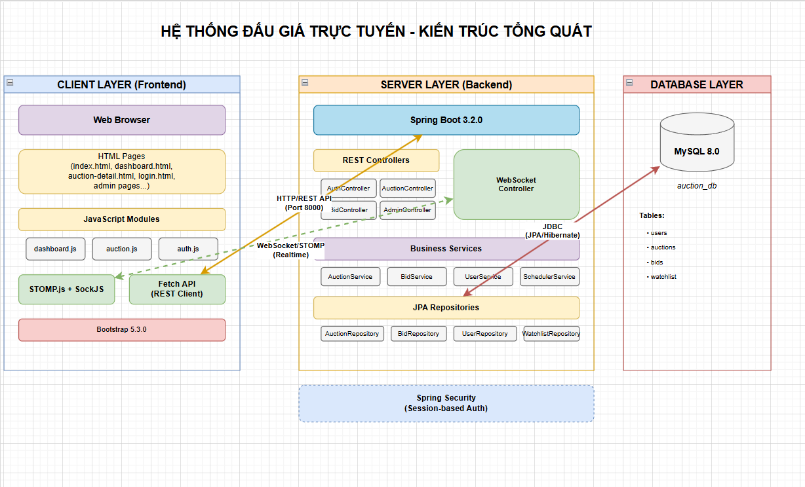

# BÀI TẬP LỚN: LẬP TRÌNH MẠNG

## [Tên dự án của nhóm]

> 📘 _Mẫu README này là khung hướng dẫn. Sinh viên chỉ cần điền thông tin của nhóm và nội dung dự án theo từng mục._

---

## 🧑‍💻 THÔNG TIN NHÓM

| STT | Họ và Tên         | MSSV       | Email                  | Đóng góp |
| --- | ----------------- | ---------- | ---------------------- | -------- |
| 1   | Nguyễn Trọng Khởi | B22DCCN471 | kddmelothree@gmail.com | 100%     |
| 2   | Trương Huy Tâm    | B22DCCN711 | huytam514@gmail.com    | 100%     |
| 3   | Vũ Thành Nam      | B22DCCN568 | nvuthanh4@gmail.com    | 100%     |

**Tên nhóm:** Nhóm 06 – Lập trình mạng  
**Chủ đề đã đăng ký: HỆ THỐNG ĐẤU GIÁ TRỰC TUYẾN**

---

## 🧠 MÔ TẢ HỆ THỐNG

Hệ thống bao gồm **server** (Spring Boot) xử lý logic nghiệp vụ đấu giá và **client** (Web App) giao tiếp với server qua hai kênh:

- **REST API (HTTP):** Cho các thao tác CRUD (đăng nhập, tạo đấu giá, đặt giá, quản lý watchlist)
- **WebSocket (STOMP):** Cho real-time bidirectional communication, tự động cập nhật giá đấu mới đến tất cả clients đang online

Server kết nối với **MySQL database** để lưu trữ dữ liệu người dùng, đấu giá, lượt đặt giá và danh sách theo dõi. Hệ thống có **Scheduler** tự động quản lý vòng đời auction (start/end) và cơ chế **auto-extend** thông minh khi có bid phút cuối.

**Cấu trúc logic tổng quát:**

```
Web Client (Port 3000)  <-->  Spring Boot Server (Port 8000)  <-->  MySQL Database (Port 3306)
      |                              |
      |                              |
   HTTP REST API              WebSocket STOMP
   (Request/Response)         (Real-time Broadcast)
      |                              |
      └──────────────┬───────────────┘
                     ↓
          Real-time Auction System
```

**Sơ đồ hệ thống:**



---

---

## ⚙️ CÔNG NGHỆ SỬ DỤNG

> Liệt kê công nghệ, framework, thư viện chính mà nhóm sử dụng.

| Thành phần | Công nghệ                                    | Ghi chú                 |
| ---------- | -------------------------------------------- | ----------------------- |
| Server     | Java 17 + Spring Boot 3.2.0                  | REST API + WebSocket    |
| Client     | Html + Css + JavaScript                      | Web Application         |
| Database   | MySQL 8.0                                    | Lưu trữ dữ liệu         |
| WebSocket  | Spring WebSocket + STOMP (SockJS + STOMP.js) | Real-time communication |
| Build Tool | Maven 3.8+ (Backend) + npm (Frontend)        | Dependency management   |

---

## 🚀 HƯỚNG DẪN CHẠY DỰ ÁN

### 1. Clone repository

```bash
git clone <repository-url>
cd assignment-network-project
```

### 2. Chạy server

```bash
cd source/server
# Các lệnh để khởi động server
```

### 3. Chạy client

```bash
cd source/client
# Các lệnh để khởi động client
```

### 4. Kiểm thử nhanh

```bash
# Các lệnh test
```

---

## 🔗 GIAO TIẾP (GIAO THỨC SỬ DỤNG)

| Endpoint   | Protocol | Method | Input                              | Output             |
| ---------- | -------- | ------ | ---------------------------------- | ------------------ |
| `/health`  | HTTP/1.1 | GET    | —                                  | `{"status": "ok"}` |
| `/compute` | HTTP/1.1 | POST   | `{"task":"sum","payload":[1,2,3]}` | `{"result":6}`     |

---

## 📊 KẾT QUẢ THỰC NGHIỆM

> Đưa ảnh chụp kết quả hoặc mô tả log chạy thử.


---

## 🧩 CẤU TRÚC DỰ ÁN

```
assignment-network-project/
├── README.md
├── INSTRUCTION.md
├── statics/
│   ├── diagram.png
│   └── dataset_sample.csv
└── source/
    ├── .gitignore
    ├── client/
    │   ├── README.md
    │   └── (client source files...)
    ├── server/
    │   ├── README.md
    │   └── (server source files...)
    └── (các module khác nếu có)
```

---

## 🧩 HƯỚNG PHÁT TRIỂN THÊM

> Nêu ý tưởng mở rộng hoặc cải tiến hệ thống.

- [ ] Cải thiện giao diện người dùng
- [ ] Thêm tính năng xác thực và phân quyền
- [ ] Tối ưu hóa hiệu suất
- [ ] Triển khai trên cloud

---

## 📝 GHI CHÚ

- Repo tuân thủ đúng cấu trúc đã hướng dẫn trong `INSTRUCTION.md`.
- Đảm bảo test kỹ trước khi submit.

---

## 📚 TÀI LIỆU THAM KHẢO

> (Nếu có) Liệt kê các tài liệu, API docs, hoặc nguồn tham khảo đã sử dụng.
